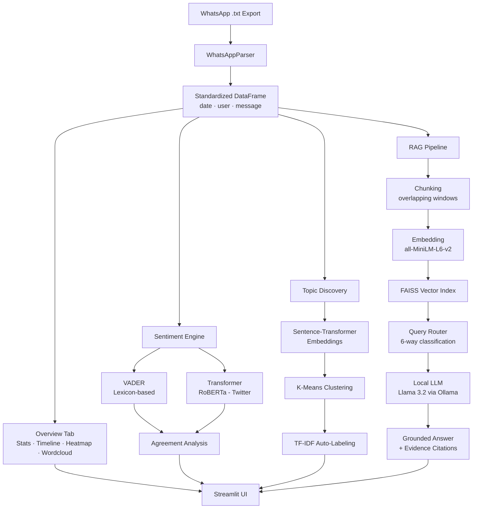
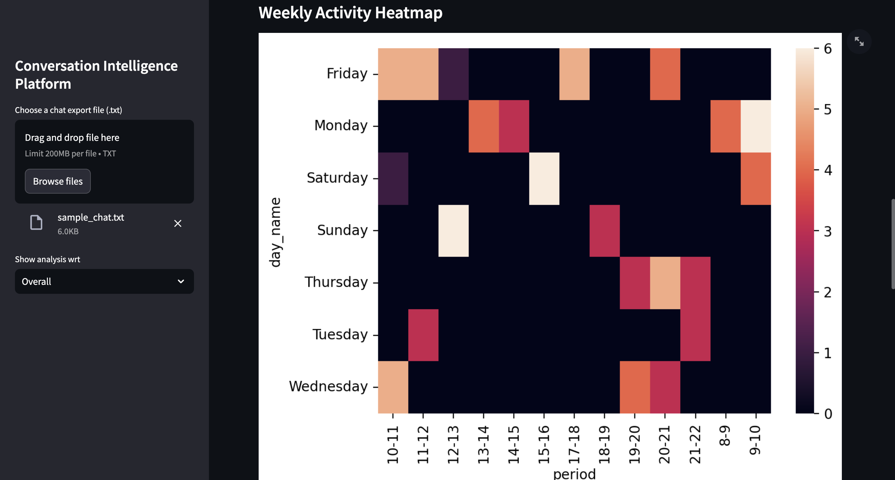
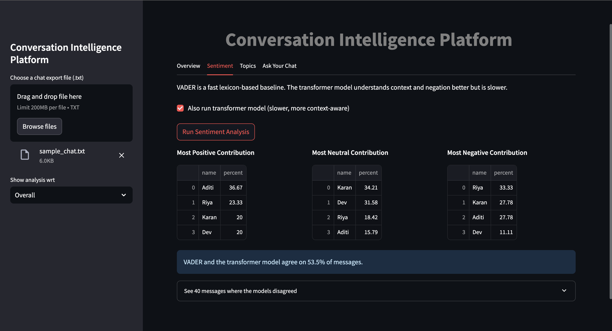
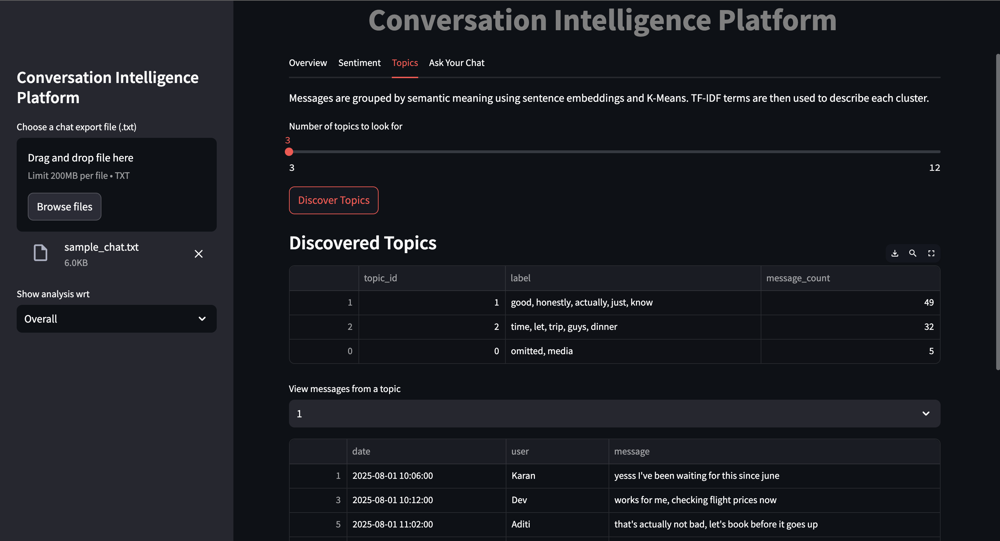
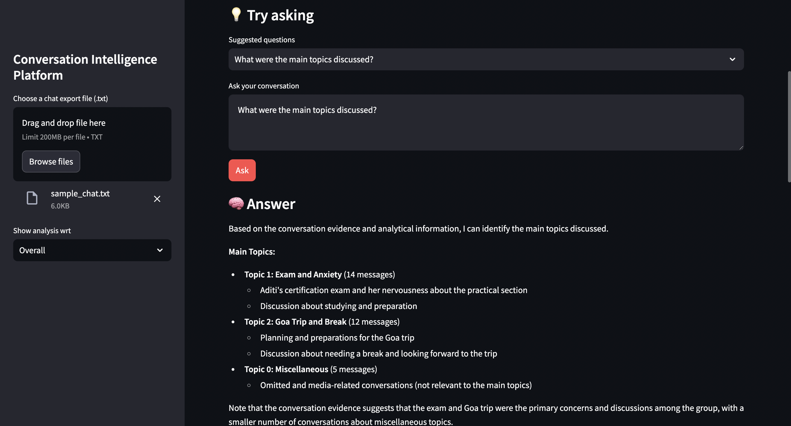
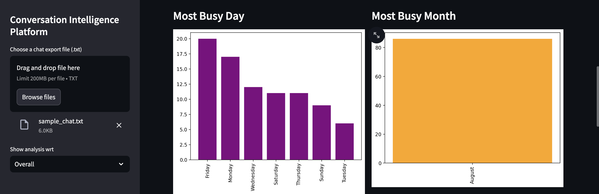

# 💬 Converso AI — Conversation Intelligence Platform

A local-first Python/Streamlit platform that turns raw WhatsApp chat exports into statistical, sentiment, topic, and conversational-AI insights . Everything, including the LLM used for Q&A, runs on your own machine.

---

## 🚀 Key Features

### 📊 Conversation Analytics
- Message, word, media, and link counts — overall or per user
- Monthly timeline, weekly activity heatmap, busiest day/month
- Most active users with contribution percentages

### 🙂 Sentiment Analysis
- Sentiment scoring using both **VADER** (lexicon-based) and a local **transformer model**, with an agreement rate shown between the two
- Includes a small evaluation script (`eval/`) to check model accuracy against human-verified labels

### 🧠 Topic Discovery
- Groups messages by meaning (via embeddings + clustering) instead of just common words
- Each topic auto-labeled using TF-IDF top terms

### 🤖 Ask Your Chat — Retrieval-Augmented Q&A
- Chat history is chunked (overlapping windows), embedded, and indexed in **FAISS**
- A local LLM (**Llama 3.2 / 3.1 via Ollama**) answers questions grounded *only* in retrieved evidence — no hallucinated facts
- **6-way intelligent query routing** decides how to answer each question:

| Question Type | Example | How it's Answered |
|---|---|---|
| Statistics | "Who is the most active user?" | Direct pandas computation |
| Date-specific | "What happened on 15 August?" | Filtered message retrieval |
| User-specific | "What did Rahul talk about?" | User-filtered semantic search |
| Topic | "What were the main topics?" | Topic-summary + retrieval |
| Sentiment | "What was the overall mood?" | Sentiment-distribution + retrieval |
| General / Summary | "Summarize the conversation." | Full RAG pipeline |

- Every answer comes with **citation-backed evidence**: the exact messages, dates, and users the answer was grounded in

---

## 🏗️ Architecture

---

<!-- ## 📸 Screenshots

| Overview | Sentiment | Topic Discovery | Ask Your Chat |
|---|---|---|---|
|  |  |  |  | -->

## 📸 Screenshots

### Overview
*(scrollable page — top and bottom halves shown separately)*

### Sentiment Analysis

### Topic Discovery

### Q&A ChatBot

